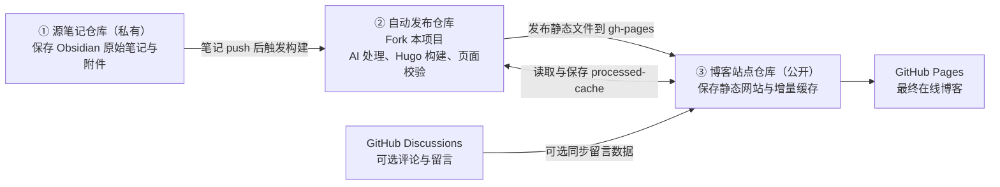

# Auto Blog Poster

自动把 Obsidian 笔记变成可公开阅读的技术博客：识别真实内容变化，通过 AI 脱敏与润色，处理图片、公式、Mermaid 和代码，生成 Hugo 网站，完成浏览器校验后发布到 GitHub Pages。

<p align="center">
  <a href="https://bluhuang.github.io/blogs-of-bluhuang/"></a>
  <a href="https://github.com/bluhuang/auto-blog-poster/stargazers"></a>
  <a href="https://github.com/bluhuang/auto-blog-poster/fork"></a>
</p>

<a href="https://bluhuang.github.io/blogs-of-bluhuang/">
  
</a>

日常只需要继续在 Obsidian 中写笔记并推送仓库。内容处理、页面生成、发布前检查和线上部署由自动化流程完成。

## 最终效果

### 首页

集中展示个人介绍、最近更新、知识库入口和 GitHub Discussions 留言板。点击图片可直接进入博客首页。

<a href="https://bluhuang.github.io/blogs-of-bluhuang/">
  
</a>

### 博客列表

将 Obsidian 目录转换成可浏览的知识树，并按照文章内容的真实更新时间展示最近更新。

<a href="https://bluhuang.github.io/blogs-of-bluhuang/blogs/">
  
</a>

### 文章阅读页

支持公式、Mermaid、代码高亮、图片、章节目录和阅读时间，并适配明暗模式与不同屏幕尺寸。

<a href="https://bluhuang.github.io/blogs-of-bluhuang/ai/0-paper/cnn-net/4-mobilenetv2---inverted-residuals-and-linear-bottlenecks/">
  
</a>

以上截图由构建流程自动生成，不需要手动维护。每次成功构建都会用最新页面覆盖旧图。

## 关键能力

### 从私人笔记到公开文章


### 从构建结果到可靠发布


## 它解决什么问题

- **私人笔记不能直接公开**：自动去除敏感信息，可配置地把内部或私人语境转换为公开的技术讨论。
- **Obsidian 内容不能直接搬到网站**：处理附件路径、图片语法、公式、Mermaid、代码和目录层级。
- **每次全量调用 AI 成本高且不稳定**：通过内容哈希、模型响应缓存和重命名迁移，只处理真正变化的文章。
- **Hugo 构建成功不代表页面正常**：部署前使用真实 Chromium 检查公式、图片、目录、溢出、明暗模式和移动端布局。

## 工作原理

运行这套系统需要三个 GitHub 仓库。仓库名称可以自由决定，但三个仓库的职责必须分开：



| 仓库角色 | 是否公开 | 保存什么 | 负责什么 |
|---|---|---|---|
| **源笔记仓库** | 建议私有 | Obsidian Vault 中准备发布的笔记和附件 | 作为唯一内容源；笔记 push 后触发自动发布 |
| **自动发布仓库** | 公开或私有均可 | 本项目的代码、Hugo 模板和配置 | 检测变化、调用 AI、转换内容、构建网站、校验页面并部署 |
| **博客站点仓库** | 必须公开才能免费使用 GitHub Pages | 生成后的 HTML、CSS、图片，以及 `processed-cache` 分支 | 承载最终博客，并保存下一次增量构建需要的缓存 |

一次完整发布会经历以下过程：

```text
1. 你在 Obsidian 中新增、修改、移动或删除笔记
2. 源笔记仓库 push 后向自动发布仓库发送 repository_dispatch
3. 自动发布仓库拉取指定笔记目录，并恢复上一次 processed-cache
4. 系统比较内容哈希，只处理真正发生变化的笔记
5. DeepSeek 对变化内容进行脱敏、润色和公开化改写
6. 系统转换 Obsidian 图片、附件、公式、Mermaid、代码与目录结构
7. Hugo 生成首页、博客列表、文章页、导航和搜索索引
8. Playwright 使用 Chromium 检查桌面端、移动端和明暗模式
9. 校验通过后，静态网站被推送到博客站点仓库的 gh-pages 分支
10. 本次生成结果和 AI 响应被保存到 processed-cache 分支
```

三个仓库分开的意义是：原始私人笔记不会公开，自动化代码可以独立升级，GitHub Pages 仓库只保存适合公开访问的最终产物。

## 开始使用

下面使用一组示例名称说明完整搭建过程。你可以替换为自己的名称：

| 角色 | 示例仓库名 |
|---|---|
| 源笔记仓库 | `my-obsidian-notes` |
| 自动发布仓库 | Fork 后的 `auto-blog-poster` |
| 博客站点仓库 | `my-tech-blog` |

最终博客地址将是：

```text
https://YOUR_GITHUB_NAME.github.io/my-tech-blog/
```

### 第 1 步：Star 并 Fork 本项目

1. 点击当前仓库右上角的 **Star**。
2. 点击 **Fork**。
3. `Owner` 选择自己的 GitHub 账号。
4. 仓库名称可以继续使用 `auto-blog-poster`。
5. 完成 Fork 后，进入你自己的仓库。
6. 打开 **Actions** 页面；如果 GitHub 提示 Fork 的工作流尚未启用，点击 **I understand my workflows, go ahead and enable them**。

Fork 不会复制原仓库的 Secrets，后面必须在自己的仓库中重新配置。

### 第 2 步：准备源笔记仓库

1. 在 GitHub 新建一个仓库，例如 `my-obsidian-notes`。
2. 将仓库设置为 **Private**，避免原始笔记公开。
3. 将准备发布的笔记集中放在一个固定目录中，例如：

```text
my-obsidian-notes/
├── 2 Notes/
│   ├── start/
│   │   └── hello-world.md
│   ├── AI/
│   └── Coding/
├── attachments/
└── .obsidian/
```

4. 在 `2 Notes/start/hello-world.md` 中先创建一篇用于首次验证的文章：

```markdown
# Hello World

这是我的第一篇自动发布文章。

## 自动发布测试

如果你能在 GitHub Pages 中看到这篇文章，说明整条流程已经运行成功。
```

5. 使用你习惯的方式把 Obsidian Vault 同步到这个仓库，例如 Obsidian Git 插件或本地 Git。

系统只读取 `notes_subdir` 指定的目录，不会自动发布 Vault 中的其他笔记。

### 第 3 步：创建博客站点仓库

1. 在 GitHub 新建一个仓库，例如 `my-tech-blog`。
2. 将仓库设置为 **Public**。
3. 勾选 **Add a README file**，确保仓库可以正常创建。
4. 暂时不用配置 GitHub Pages；第一次成功构建后，系统会自动创建 `gh-pages` 和 `processed-cache` 分支。

这个仓库只保存生成后的网站，不要把原始 Obsidian 笔记放进来。

### 第 4 步：创建 GitHub Token

自动发布需要读取私有笔记仓库、写入博客站点仓库，并接收源笔记仓库的触发请求。

推荐创建 Fine-grained personal access token：

1. 打开 GitHub：`Settings → Developer settings → Personal access tokens → Fine-grained tokens`。
2. 点击 **Generate new token**。
3. `Resource owner` 选择自己的账号。
4. `Repository access` 选择 **Only select repositories**。
5. 选择以下三个仓库：
   - `my-obsidian-notes`
   - Fork 后的 `auto-blog-poster`
   - `my-tech-blog`
6. 在 `Repository permissions` 中，将 **Contents** 设置为 **Read and write**。
7. 创建 Token，并立即复制保存。GitHub 之后不会再次完整显示它。

如果三个仓库不属于同一个账号或组织，需要分别创建具有对应仓库权限的 Token。

### 第 5 步：修改自动发布配置

进入 Fork 后的 `auto-blog-poster`，直接在 GitHub 网页中编辑 `config.yaml`。

至少修改以下内容：

```yaml
source:
  owner: YOUR_GITHUB_NAME
  repo: my-obsidian-notes
  branch: main
  notes_subdir: 2 Notes
  file_pattern: "*.md"

output:
  owner: YOUR_GITHUB_NAME
  repo: my-tech-blog
  branch: gh-pages
  content_dir: content/
  static_dir: static/

deployment:
  target_repo: YOUR_GITHUB_NAME/my-tech-blog
  target_branch: gh-pages
  commit_message: Auto deploy from blog poster [skip ci]

processing:
  local_vault_path: ""
  incremental: true
  force_reprocess_all: false

validation:
  published_origin: https://YOUR_GITHUB_NAME.github.io
  base_path: /my-tech-blog
  public_dir: public
  browser_test_paths:
    - /start/hello-world/
  image_check_paths:
    - /start/hello-world/

readme_preview:
  enabled: true
  article_path: /start/hello-world/
```

注意：

- `source.notes_subdir` 必须与源笔记仓库中的目录名称完全一致。
- `deployment.target_repo` 必须写成 `账号名/仓库名`。
- `validation.base_path` 必须与博客站点仓库名称一致。
- `browser_test_paths` 必须指向一篇真实存在的文章，否则构建会因为找不到验证页面而失败。
- `processing.local_vault_path` 只用于本地开发；GitHub Actions 中应设为空字符串。
- 如果不使用仓库中的个人图片，请删除 `processing.personal_images`，或者改成你自己的图片路径。

然后编辑 `hugo.toml`：

```toml
baseURL = "https://YOUR_GITHUB_NAME.github.io/my-tech-blog/"
title = "My Tech Blog"
```

再编辑 `config/_default/params.toml`，至少替换以下个人信息：

```toml
logo_text = "My Tech Blog"
mainSections = ["start", "AI", "Coding"]

[search]
include_sections = ["start", "AI", "Coding"]

[metadata]
keywords = ["blog", "tech"]
description = "My personal tech blog"
author = "YOUR_NAME"

[personal]
avatar = "images/avatar.jpg"
name = "YOUR_NAME"
bio = "你的个人介绍"
intro = "这个博客主要记录什么"

[giscus]
enable = false
```

先关闭 Giscus，可以减少首次搭建时的变量。网站上线后再单独配置评论系统。

### 第 6 步：在自动发布仓库中配置 Secrets

进入 Fork 后的 `auto-blog-poster`：

`Settings → Secrets and variables → Actions → New repository secret`

添加两个 Secret：

| Name | Value |
|---|---|
| `GH_PAT` | 第 4 步创建的 GitHub Token |
| `DEEPSEEK_API_KEY` | 你的 DeepSeek API Key |

名称必须完全一致，包括大小写。

### 第 7 步：让源笔记仓库触发发布

进入 `my-obsidian-notes`，先在以下位置添加同一个 GitHub Token：

`Settings → Secrets and variables → Actions → New repository secret`

Secret 名称仍然是：

```text
GH_PAT
```

然后创建文件：

```text
.github/workflows/trigger-blog.yml
```

写入：

```yaml
name: Trigger Blog Update

on:
  push:
    branches: [main]
  workflow_dispatch:

jobs:
  trigger:
    runs-on: ubuntu-latest
    steps:
      - name: Trigger blog build
        run: |
          curl --fail-with-body -X POST \
            -H "Authorization: Bearer ${{ secrets.GH_PAT }}" \
            -H "Accept: application/vnd.github+json" \
            -H "X-GitHub-Api-Version: 2022-11-28" \
            https://api.github.com/repos/YOUR_GITHUB_NAME/auto-blog-poster/dispatches \
            -d '{"event_type":"trigger-deploy"}'
```

将 `YOUR_GITHUB_NAME` 替换为你的账号名。如果 Fork 时修改了自动发布仓库名称，也要同步修改 URL。

提交这个文件后，源笔记仓库的每次 push 都会触发博客构建。

### 第 8 步：执行第一次构建

第一次构建建议手动执行，便于检查配置：

1. 打开 Fork 后的 `auto-blog-poster`。
2. 进入 **Actions**。
3. 选择左侧的 **Deploy Blog**。
4. 点击右侧 **Run workflow**。
5. Branch 选择 `main`。
6. 再次点击绿色的 **Run workflow**。
7. 等待工作流完成。

成功后，`my-tech-blog` 中会出现：

- `gh-pages`：最终静态网站
- `processed-cache`：处理后的文章、图片、内容哈希和 AI 响应缓存

如果构建失败，打开失败的 Job 查看具体步骤。工作流还会上传：

- `auto-blog-log`：内容处理日志
- `hugo-public`：本次构建生成的网站文件

### 第 9 步：启用 GitHub Pages

第一次构建成功后，进入 `my-tech-blog`：

1. 打开 `Settings → Pages`。
2. `Source` 选择 **Deploy from a branch**。
3. Branch 选择 `gh-pages`。
4. Folder 选择 `/(root)`。
5. 点击 **Save**。
6. 等待 GitHub Pages 发布完成。

然后访问：

```text
https://YOUR_GITHUB_NAME.github.io/my-tech-blog/
```

如果出现样式丢失或页面 404，优先检查 `hugo.toml` 的 `baseURL` 和 `config.yaml` 的 `validation.base_path` 是否与仓库名一致。

### 第 10 步：验证自动更新

1. 回到 Obsidian，修改 `2 Notes/start/hello-world.md`。
2. 将变化 push 到源笔记仓库。
3. 打开源笔记仓库的 Actions，确认 `Trigger Blog Update` 成功。
4. 打开自动发布仓库的 Actions，确认 `Deploy Blog` 被自动触发。
5. 构建完成后刷新 GitHub Pages，确认文章已经更新。

之后的日常使用只剩两件事：在 Obsidian 中写笔记，然后 push。

### 第 11 步：替换 README 中的演示地址

Fork 后的 README 默认仍展示本项目的示例博客。你的网站上线后，将 README 中以下地址替换为自己的：

```text
https://bluhuang.github.io/blogs-of-bluhuang/
```

替换为：

```text
https://YOUR_GITHUB_NAME.github.io/my-tech-blog/
```

自动截图位于博客站点的：

```text
/readme/homepage.png
/readme/blog-library.png
/readme/article-reading.png
```

因此替换地址后，你的 Fork 会自动展示自己博客的最新页面。

### 常见问题

| 问题 | 优先检查 |
|---|---|
| 无法拉取私有笔记仓库 | `GH_PAT` 是否选择了源笔记仓库，并具有 Contents 权限 |
| 无法推送博客站点仓库 | `GH_PAT` 是否选择了博客站点仓库，并具有 Contents: Read and write |
| `Browser validation has no matching test page` | `browser_test_paths` 是否对应真实文章路径 |
| README 自动截图失败 | `readme_preview.article_path` 是否存在，`/blogs/` 是否成功生成 |
| GitHub Pages 打开后样式丢失 | `baseURL`、`published_origin` 和 `base_path` 是否一致 |
| Push 笔记后没有触发构建 | 源笔记仓库的工作流 URL、`GH_PAT` 和目标仓库名称是否正确 |
| 所有文章都被重新调用 AI | 是否保留了博客站点仓库的 `processed-cache` 分支 |

## 技术栈

Python · DeepSeek API · Hugo · Hugoplate · GitHub Actions · GitHub Pages · Playwright · Tailwind CSS · KaTeX · Mermaid · Giscus
