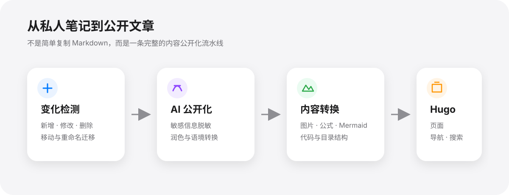
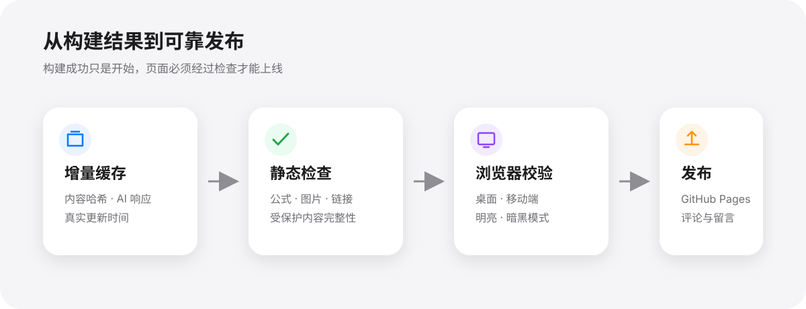
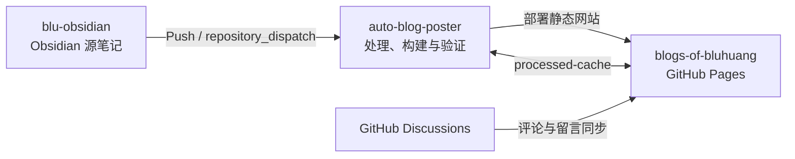

# Auto Blog Poster

自动把 Obsidian 笔记变成可公开阅读的技术博客：识别真实内容变化，通过 AI 脱敏与润色，处理图片、公式、Mermaid 和代码，生成 Hugo 网站，完成浏览器校验后发布到 GitHub Pages。

<p align="center">
  <a href="https://bluhuang.github.io/blogs-of-bluhuang/"></a>
  <a href="https://github.com/bluhuang/auto-blog-poster/stargazers"></a>
  <a href="https://github.com/bluhuang/auto-blog-poster/fork"></a>
</p>

<a href="https://bluhuang.github.io/blogs-of-bluhuang/">
  
</a>

日常只需要继续在 Obsidian 中写笔记并推送仓库。内容处理、页面生成、发布前检查和线上部署由自动化流程完成。

## 最终效果

### 首页

集中展示个人介绍、最近更新、知识库入口和 GitHub Discussions 留言板。点击图片可直接进入博客首页。

<a href="https://bluhuang.github.io/blogs-of-bluhuang/">
  
</a>

### 博客列表

将 Obsidian 目录转换成可浏览的知识树，并按照文章内容的真实更新时间展示最近更新。

<a href="https://bluhuang.github.io/blogs-of-bluhuang/blogs/">
  
</a>

### 文章阅读页

支持公式、Mermaid、代码高亮、图片、章节目录和阅读时间，并适配明暗模式与不同屏幕尺寸。

<a href="https://bluhuang.github.io/blogs-of-bluhuang/ai/0-paper/cnn-net/4-mobilenetv2---inverted-residuals-and-linear-bottlenecks/">
  
</a>

以上截图由构建流程自动生成，不需要手动维护。每次成功构建都会用最新页面覆盖旧图。

## 关键能力

### 从私人笔记到公开文章



### 从构建结果到可靠发布



## 它解决什么问题

- **私人笔记不能直接公开**：自动去除敏感信息，可配置地把内部或私人境转换为公开的技术讨论。
- **Obsidian 内容不能直接搬到网站**：处理附件路径、图片语法、公式、Mermaid、代码和目录层级。
- **每次全量调用 AI 成本高且不稳定**：通过内容哈希、模型响应缓存和重命名迁移，只处理真正变化的文章。
- **Hugo 构建成功不代表页面正常**：部署前使用真实 Chromium 检查公式、图片、目录、溢出、明暗模式和移动端布局。

## 工作原理

整个流程由三个 GitHub 仓库协作完成：



| 仓库 | 作用 |
|---|---|
| `blu-obsidian` | 保存原始 Obsidian 笔记，笔记 push 后触发发布 |
| `auto-blog-poster` | 检测变化、调用 DeepSeek、转换内容、构建 Hugo、校验并部署 |
| `blogs-of-bluhuang` | 保存静态网站和增量缓存，承载 GitHub Pages 与留言同步 |

```text
Obsidian 笔记更新
        ↓
检测新增、修改、删除和移动
        ↓
AI 脱敏润色 + Obsidian 内容转换
        ↓
生成 Hugo 页面、导航与搜索索引
        ↓
静态检查 + Playwright 浏览器检查
        ↓
发布到 GitHub Pages 并保存增量缓存
```

## 开始使用

当前仓库是一个正在实际运行的完整实现。搭建自己的版本时，建议从 GitHub 直接开始：

### 1. Star 并 Fork

1. 点击页面右上角 **Star**，保存项目。
2. 点击 **Fork**，将仓库复制到自己的 GitHub 账号。
3. 在 Fork 后的仓库中启用 GitHub Actions。

### 2. 准备三个仓库

- 一个私人仓库保存 Obsidian 笔记。
- Fork 后的 `auto-blog-poster` 负责处理和构建。
- 一个公开仓库保存生成的网站并启用 GitHub Pages。

### 3. 修改配置

在 Fork 后的仓库中修改 `config.yaml`：

- `source`：Obsidian 源仓库和笔记目录
- `output` / `deployment`：GitHub Pages 仓库和分支
- `processing.deepseek_api`：AI 处理规则
- `validation`：博客域名和需要检查的文章
- `processing.personal_images`：个人图片，可删除或替换

### 4. 配置 Secrets

进入 Fork 后的仓库：

`Settings → Secrets and variables → Actions`

添加：

| Secret | 用途 |
|---|---|
| `DEEPSEEK_API_KEY` | 调用 DeepSeek 处理变化后的笔记 |
| `GH_PAT` | 读取私人笔记仓库并写入发布仓库 |

### 5. 连接源笔记仓库

在 Obsidian 仓库中添加一个 GitHub Actions 工作流，在笔记 push 后向 Fork 的 `auto-blog-poster` 发送 `repository_dispatch`。

```yaml
name: Trigger Blog Update

on: [push]

jobs:
  trigger:
    runs-on: ubuntu-latest
    steps:
      - name: Trigger blog build
        run: |
          curl -X POST \
            -H "Authorization: token ${{ secrets.GH_PAT }}" \
            -H "Accept: application/vnd.github.v3+json" \
            https://api.github.com/repos/YOUR_NAME/auto-blog-poster/dispatches \
            -d '{"event_type":"trigger-deploy"}'
```

完成后，继续在 Obsidian 中写笔记并 push 即可触发发布。

## 技术栈

Python · DeepSeek API · Hugo · Hugoplate · GitHub Actions · GitHub Pages · Playwright · Tailwind CSS · KaTeX · Mermaid · Giscus
